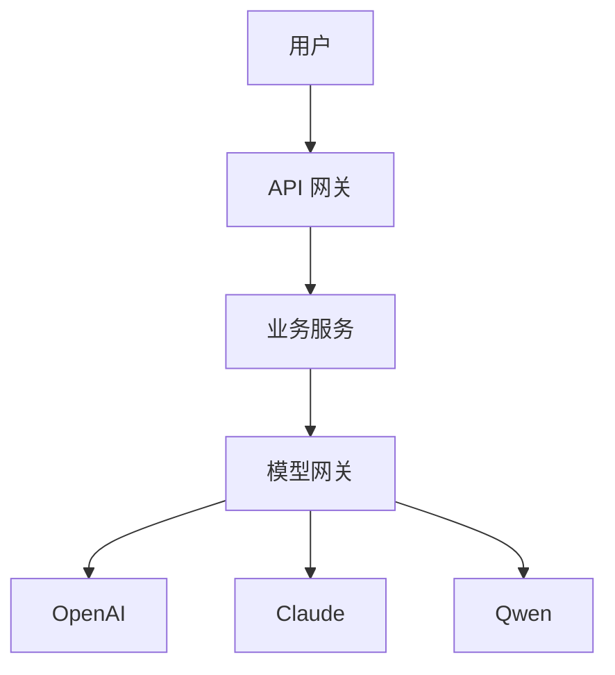

# 架构设计文档

本目录用于存放系统的架构设计文档。

## 目录结构

```
architecture/
├── README.md                      # 本文件
├── system/                        # 系统架构设计
│   ├── overview.md                # 系统总览
│   ├── microservices.md           # 微服务架构
│   ├── api-gateway.md             # API 网关设计
│   └── service-mesh.md            # 服务网格
├── database/                      # 数据库架构
│   ├── data-model.md              # 数据模型
│   ├── storage-strategy.md        # 存储策略
│   └── caching.md                 # 缓存策略
├── ai-infrastructure/             # AI 基础设施
│   ├── model-gateway.md           # 模型网关设计
│   ├── model-selection.md         # 模型选择策略
│   ├── rag-architecture.md        # RAG 架构
│   ├── agent-framework.md         # Agent 框架
│   └── evaluation-system.md       # 评测系统
└── deployment/                    # 部署架构
    ├── cloud-infrastructure.md    # 云基础设施
    ├── ci-cd.md                   # CI/CD 流程
    ├── monitoring.md              # 监控与告警
    └── disaster-recovery.md       # 灾备与容灾
```

## 文档编写规范

### 1. 文档格式
- 使用 Markdown 格式
- 包含清晰的目录结构
- 使用图表辅助说明（推荐 Mermaid）

### 2. 内容要求
- **背景**：为什么需要这个架构
- **目标**：要解决什么问题
- **设计**：具体的架构方案
- **权衡**：设计决策的 Trade-off
- **演进**：未来可能的优化方向

### 3. 图表示例


## 当前架构重点

基于当前业务特点，架构设计重点关注：

1. **模型网关**：统一管理多家模型厂商，保障稳定性和灵活性
2. **AI 应用架构**：支撑创作型和演绎型应用的快速开发
3. **成本优化**：在保证质量的前提下优化模型调用成本
4. **性能保障**：实时场景延迟控制（目标 < 5s）
5. **可扩展性**：支撑百万用户规模的扩展能力

## 文档更新记录

| 日期 | 文档 | 更新内容 | 作者 |
|------|------|----------|------|
| 2026-01-18 | README.md | 创建架构设计目录结构 | Claude |

---

*创建日期：2026-01-18*
